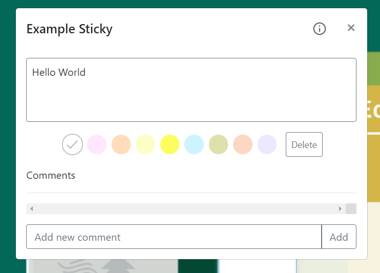
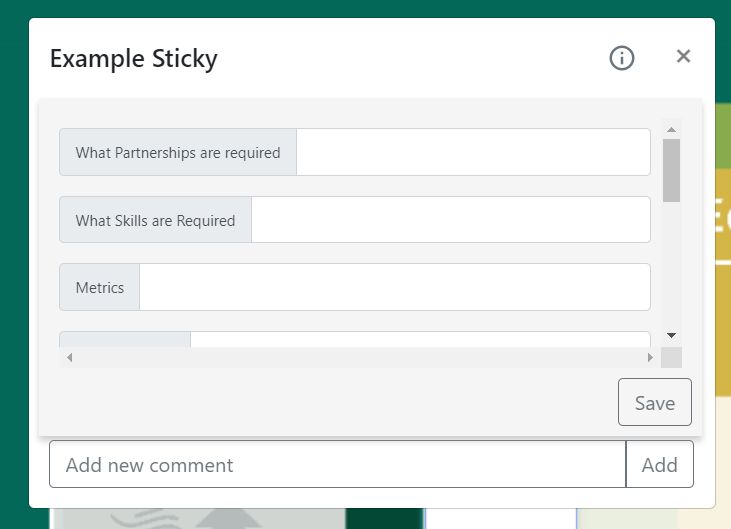

# Flourishing Business Canvas/TEAM NAME

## Iteration 03 - Review & Retrospect

 * When: Mar 31, 2019
 * Where: BA3185

## Process - Reflection

#### Decisions that turned out well

List process-related (i.e. team organization) decisions that, in retrospect, turned out to be successful.

 * 2 - 4 decisions.
 * Ordered from most to least important.
 * Explain why (i.e. give a supporting argument) you consider a decision to be successful.
 * Feel free to refer/link to process artifact(s).

**Used the app called "Trello" to list all the important features that we need to implement in our first meeting:**

Same as what we did in deliverable 2, before we started writing anything, we had a group meeting and listed everything we would like to implement for deliverable 3. 

This decision turned out to be successful because we had gotten used using "Trello" after deliverable 2, using the same app not only saves the effort of adapting into new things but also let all of our members aware of what we needed to finish this time.

**Fully focused on finishing the minimum viable product then kept expanding our functionalities:**

Back in deliverable 2, we tried to implement as many features that were asked from our partner as we could. This time however, we decided to choose finishing the MVP as our main purpose than implementing the new features that were suggested by our partner.

This decision turned out to be successful because by the end of deliverable 3, we were able to polish up all minimum features that were needed for our product. We might have ran out of time if we focused on building new features. 

#### Decisions that did not turn out as well as we hoped

List process-related (i.e. team organization) decisions that, in retrospect, were not as successful as you thought they would be.

 * 2 - 4 decisions.
 * Ordered from most to least important.
 * Feel free to refer/link to process artifact(s).

**Did not merge to master as frequently as we should:**

We did not merge our sub branches to master once we had finished some part of our work, instead both of our front end and back end team kept working on their major sub branches. This caused our master to be not testable until all of us started merging. We should have merged frequently so our master branch is as up to date as possible so all of our team members can have an idea of our progress.

**Removing all accounts in our back end when testing:**

When testing for removing accounts on the back end, we first removed all the accounts that can be logged into our website. This caused other team members not being to log in and test other functionalities, which was inefficient for our team. We should have kept some accounts so all of us could test at the same time.  

#### Planned changes

List any process-related changes you are planning to make (if there are any)

 * Ordered from most to least important.
 * Explain why you are making a change.

Whenever we finish coding a specific part of our product and push to the sub branch. We should start a pull request right the way and let one of the other members who is working for the same part review it, and merge to our master branch. By creating pull request frequently, all of our members will consistently get the newest version of our product which will not only make our testing easier, but will also address the conflicts, if they are any right the way.

We are making a change because we realize that we barely had any conflicting issues because we were able to always work with all of our team members in the same room. However, if any of our members was absent, it would have been really hard for them to understand what is the current progress of our product because we didn't merge to master frequently enough.

## Product - Review

#### Goals and/or tasks that were met/completed:

 * From most to least important.
 * Refer/link to artifact(s) that show that a goal/task was met/completed.
 * If a goal/task was not part of the original iteration plan, please mention it.

**Admin page:**

An admin page for our partner to approve/decline the users who want to register, invite users to become a manager, and manage all users in the website, etc. So our website can finally be running as it should, since it is a private website which requires admin's approval/invitation to use the website.

**Multiple user sync:**

Multiple users can access the same canvas page at the same time, and once a user performs any kind of valid action, such as adding or removing a sticky, rearranging it to a different box, the other users will be able to see it.

**Copy feature on the library page:**

A copy feature is implemented so the manager and admin can now copy an existing canvas if they need.

**Reallocating and improving view:**

We reallocated many of our buttons and improved many of our functions so either they became more user friendly or looked better, such as adding a regex check when entering an email, move users directly to log in page if they have not yet signed in to the website, improving the view of creating a sticky, etc.

#### Goals and/or tasks that were planned but not met/completed:

 * From most to least important.
 * For each goal/task, explain why it was not met/completed.      
   e.g. Did you change your mind, or did you just not get to it yet?

**Sticky content has links that can be redirected:**

In our deliverable 1, we originally thought that each stickies should have a link which links to the details of a sticky, such as "What partnerships are required", "What skills are required", "Metrics", etc. 

However, we decided to implement it differently so it hopefully would look more elegant.

The screenshot is shown below.

(Screenshot for a sticky)

 

(Screenshot when clicking the information button besides the closing buttion)

**Edit history popup for each sticky:**

We originally thought that there should be a button that shows the edit history of any sticky clicked. However, as we implemented our sticky system, we realized that it was not that necessary for users to know the edit history. Instead, we have a comment system for users to save their thoughtful discussion under each stickies. 

## Meeting Highlights

Going into the next iteration, our main insights are:

 * 2 - 4 items
 * Short (no more than one short paragraph per item)
 * High-level concepts that should guide your work for the next iteration.
 * These concepts should help you decide on where to focus your efforts.
 * Can be related to product and/or process.

**Merge to master frequently**

We will create pull requests and have the member in the same subgroup review the work and merge to master more frequently as we had done in this deliverable so all our team members can have access to the most up to date code.

**Search multiple canvases**

We will create a search function under the library page so users can search stickies under all of their canvases.